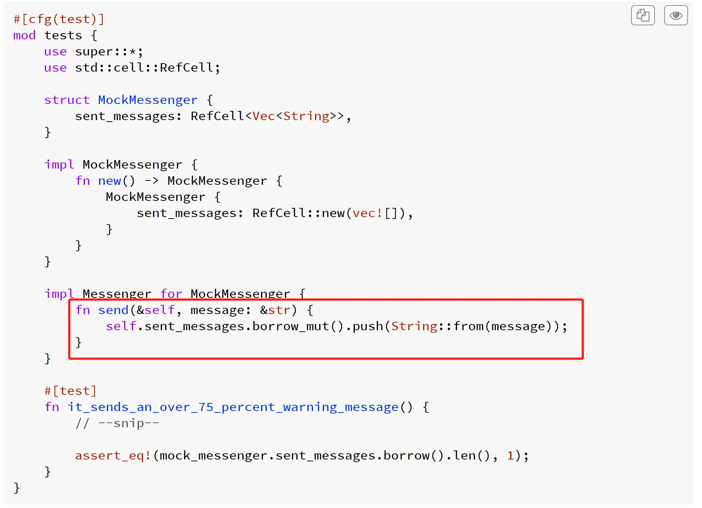
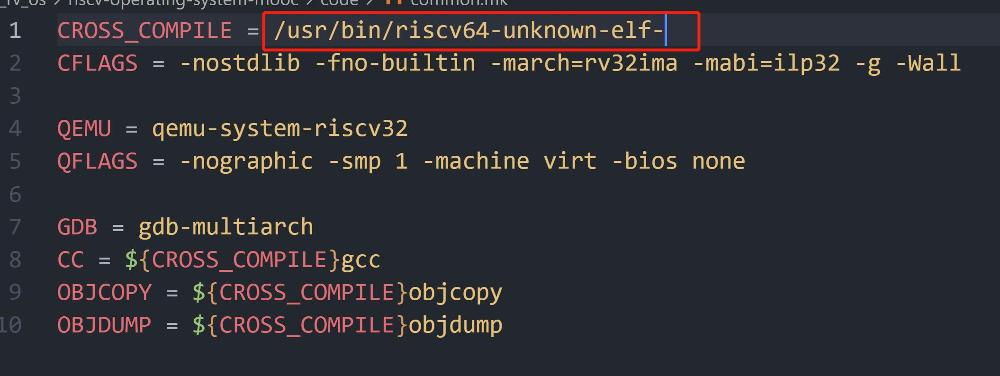
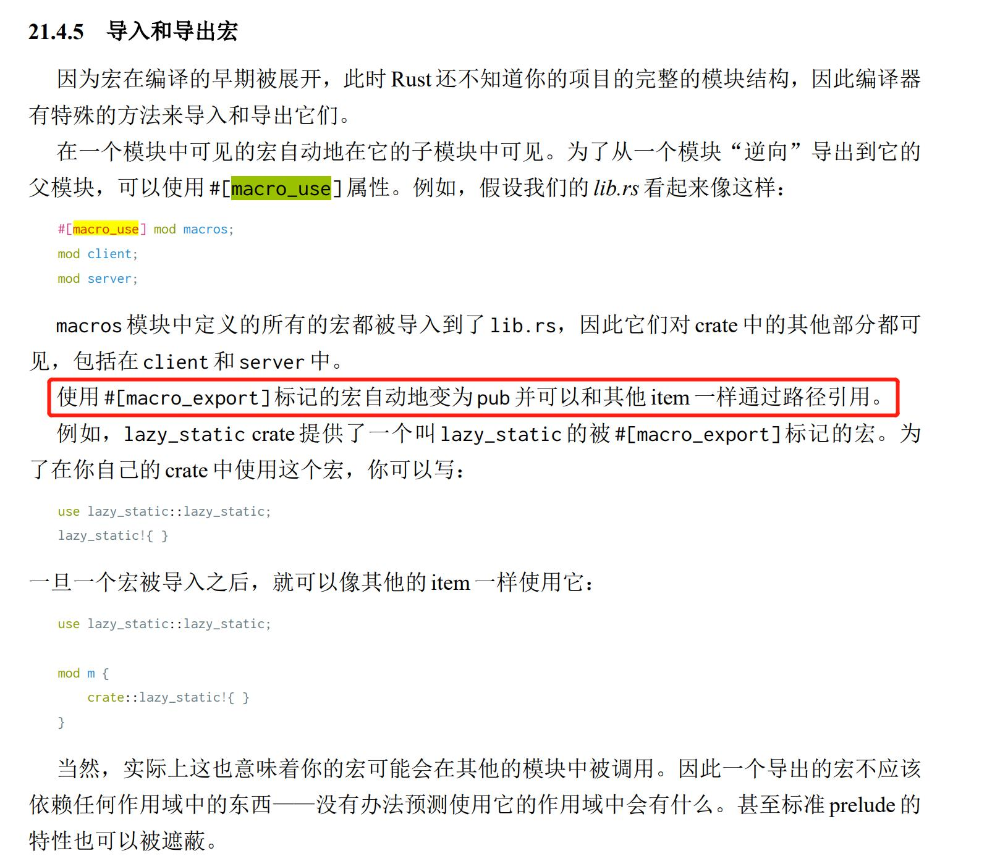
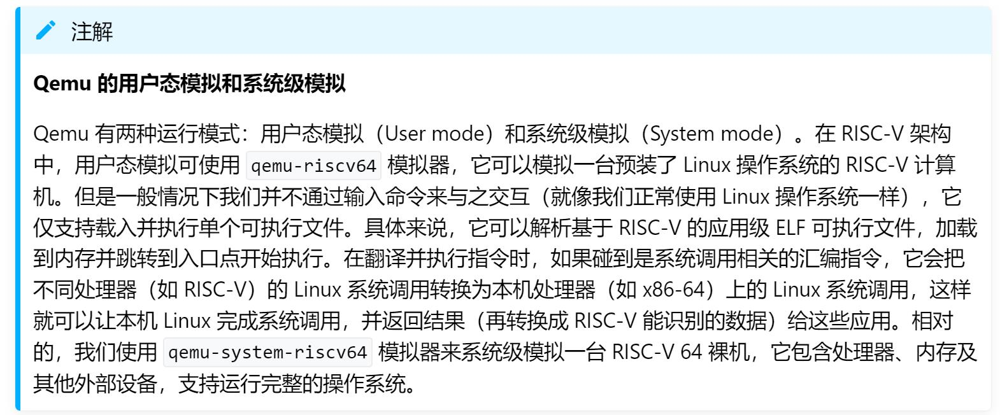

# Rcore_record
这是我学习2022 winter rcore的记录

# TOC
十月
|   MON   |   TUE   |   WED   |   THU   |   FRI   |   SAT   |   SUN   |
|---------|---------|---------|---------|---------|---------|---------|
|         |         |         |         |         |    1    |    2    |
|    3    |    4    |    5    |    6    |    7    |    8    |    9    |
|    10   |    11   |    12   |    13   |    14   |    15   |    16   |
|    17   |    18   |    19   |    20   |    21   |    22   |    23   |
|    24   |    25   |    26   | 27([D0])| 28([D1])| 29([D2])| 30([D3])|
| 31([D4])|         |         |         |         |         |         |

十一月
|   MON   |   TUE   |   WED   |   THU   |   FRI   |   SAT   |   SUN   |
|---------|---------|---------|---------|---------|---------|---------|
|         | 1([D5]) | 2([D6]) | 3([D7]) | 4([D8]) |    5    |    6    |
|    7    |    8    |    9    |    10   |    11   |    12   |    13   |
|    14   |    15   |    16   |    17   |    18   |    19   |    20   |
|    21   |    22   |    23   |    24   |    25   |    26   |    27   |
|    28   |    29   |    30   |         |         |         |         |

十二月
|   MON   |   TUE   |   WED   |   THU   |   FRI   |   SAT   |   SUN   |
|---------|---------|---------|---------|---------|---------|---------|
|         |         |         |   1     |    2    |    3    |    4    |
|    5    |    6    |    7    |    8    |    9    |    10   |    11   |
|    12   |    13   |    14   |    15   |    16   |    17   |    18   |
|    19   |    20   |    21   |    22   |    23   |    24   |    25   |
|    26   |    27   |    28   |    29   |    30   |         |         |

---
## TODO
- 学习rust宏

---

## Day0 2022-10-27
### 进度
- rustlings完成`22/84`
- 大致浏览完了整个夏令营的流程
### Day1 计划
- 做完rustlings
- 配置rcore环境
### Github Classroom
- 一个方便线上布置，写作业的feature
### 解决写rustlings时，rust-analyzer无法正常运作的问题？
- 一开始我以为是rust-analyzer lsp的老问题了，一个月前新版本有问题，需要回退老版本，但现在应该修复了，回退老版本可以[参考](https://zhuanlan.zhihu.com/p/76599587)。不过这次的原因是`rust-analyzer插件无法正常解析rustlings repo中不同源码`,解决方案参考[comp22](https://github.com/LearningOS/rust-based-os-comp2022/blob/main/QA.md)的Q8
### [理解rust中String， &str和str的区别](https://www.jianshu.com/p/d2d0eebc9575)
- `String`是一个处在stack的，包括`堆区地址，长度，容量`的胖指针，所以String的大小总是`3个字长`，64位机器上是24字节
- `str`是切片，是`unsized`,与`[u8]`一样，`所有的切片都是动态大小类型，它们都无法直接被使用。`
- `&str`才可以直接使用，因为它是`fix sized`的
## Day1 2022-10-28
### 进度
- 今天出去逛了，就只完成了rustlings`84/84`
### Day2 计划
- 学r5
- 配环境
- 用rust刷leetcode
### [to_owned()和clone()的区别](https://stackoverflow.com/questions/22264502/in-rust-what-is-the-difference-between-clone-and-to-owned)
- 简而言之，就是`clone()`返回调用者类型，比如`&str`调用`clone()`就返回`&str`,而`&str`调用`to_owned()`就返回`String`
### `Result<T, E>`的`E`
```
enum Result<T, E> {
    Ok(T),
    Err(E),
}
```
- 其中的E是Result::Err的关联类型，`all errors act the same since they all implement the 'error::Error' trait.`,所以对于`?`运算符抛出不一样的错误，可以使用`Result<(), Box<dyn error::Error>>`作为返回值类型
### [`ref`与`&`的区别](https://doc.rust-lang.org/std/keyword.ref.html)
### [self关键字](https://www.jianshu.com/p/aeb0650f574b)
- 方法参数中的`Self`是指方法接受类型，并且
```
self -> self: Self
&self -> self: &Self
&mut self -> self: &mut Self
```
### 智能指针`Box`
- `Box`可以做到讲数据分配在堆上，适用于几种情况
    - 数据大，不像在转移时进行数据拷贝
    - 类型大小在编译期无法确定，但是我们有需要固定大小的类型时，比如`Cons List`
    - 特征对象`Box<dyn trait>`,用于说明对象实现了一个特征
- `Box<T>`实现了`Deref`trait,所以无需先解开Box指针，再使用里面的T，但是在表达式中，我们无法自动隐式地执行 Deref 解引用操作，比如
```
let a = Box::new(3);
let b = a + 1;//error
```
### iterator的collect()
- iterator的`collect()`可能返回不同的collection
### rustlings值得回看的题
- `iterators3.rs`,`threads1.rs`
- `from_str.rs`中`map_err`为什么可以传入`ParsePersonError::ParseInt`?
- `try_from_into.rs`中的`type Error = IntoColorError;`?,以及`tuple`不可以迭代
- `advanced_errs1.rs`,假如一个错误类型Erra实现了`From<Errb>`trait,那么在一个返回类型为Result<T,Erra>的函数中，就可以直接使用`?`来抛出返回错误类型`Errb`，这个时候错误类型`Errb`会转换为`Erra`
## Day2 2022-10-29
### 进度 
- 效率好低┭┮﹏┭┮，就看了一点r5
- 在WSL2上配置了一下lab0
### Day3 计划
- 看完浙大的r5课
- 看完r5手册
- 做下rcore的lab0
### [关于升级配置`rustc nightly`](https://www.cnblogs.com/skzxc/p/13179732.html)
### r5 参考
- 主要参考`61c`(浙大网课ppt就是61c的)，以及`RISC-V 手册 一本开源指令集的指南`
## Day3 2022-10-30
### 进度
- 忘记了┭┮﹏┭┮
## Day4 2022-10-31
### 进度
- 浙大网课老师比起jyy，显得有点机械呀，看了三四章，觉得可以直接看书了
- 还看了[plct老师的网课](https://www.bilibili.com/video/BV1Q5411w7z5)
- 这个R5手册中文版，也太难看懂了
- leetcode
    - [N皇后II](./leetcode/N%E7%9A%87%E5%90%8EII.md)
    - [二分查找](./leetcode/704.%E4%BA%8C%E5%88%86%E6%9F%A5%E6%89%BE.md)
    - [151](./leetcode/151.%E5%8F%8D%E8%BD%AC%E5%AD%97%E7%AC%A6%E4%B8%B2%E9%87%8C%E7%9A%84%E5%8D%95%E8%AF%8D.md)
    - [二叉树的前序遍历](./leetcode/144.%E4%BA%8C%E5%8F%89%E6%A0%91%E7%9A%84%E5%89%8D%E5%BA%8F%E9%81%8D%E5%8E%86.md)
    - [字符串转化](./leetcode/8.%E5%AD%97%E7%AC%A6%E4%B8%B2%E8%BD%AC%E6%8D%A2%E6%95%B4%E6%95%B0(atoi).md)
### Day5 计划
- R5手册真难懂，明天继续看吧
### RefCell，内部可变性
- `允许使用不可变引用时改变数据`
- RefCell<T>与一般的情况不同，rust通常是在编译时检查借用规则
- Rc<T>智能指针获取的是`T的只读引用`
- Box<T>和RefCell<T>都是单一所有者
- Box<T>允许在编译时执行不可变和可变借用检查
- Rc<T>仅允许在编译时执行不可变借用检查
- RefCell<T>允许在`运行时`执行`不可变借用`或`可变借用`检查。所以可以在RefCell<T>自身不可变的情况下修改其内部的值
- 好吧，记了不少，还是很难理解，这个例子能说明RefCell<T>的用处,在这里需要传入一个`不可变引用&self`，并且在函数内部，我们修改了其内部的值
### [HART，超线程技术](https://juejin.cn/post/6989269140661862407)
- 硬件线程(HARdware Thread)使得一个物理核上虚拟出两个逻辑核心，intel核AMD都是SMT2,`超线程是一种可以将CPU内部暂时闲置处理资源充分“调动”起来的技术`
## Day5 2022-11-1
### 进度
- leetcode
    - [34.在排序数组中查找元素的第一个和最后一个位置](./leetcode/34.%E5%9C%A8%E6%8E%92%E5%BA%8F%E6%95%B0%E7%BB%84%E4%B8%AD%E6%9F%A5%E6%89%BE%E5%85%83%E7%B4%A0%E7%9A%84%E7%AC%AC%E4%B8%80%E4%B8%AA%E5%92%8C%E6%9C%80%E5%90%8E%E4%B8%80%E4%B8%AA%E4%BD%8D%E7%BD%AE.md)
    - [169.多数元素.md](./leetcode/169.%E5%A4%9A%E6%95%B0%E5%85%83%E7%B4%A0.md)
    - [234.回文链表.md](./leetcode/234.%E5%9B%9E%E6%96%87%E9%93%BE%E8%A1%A8.md)
- 看完了r5手册，还是边写rcore边看吧
### Day6 计划
- 做完lab0和lab1
## Day6 2022-11-2
### 进度
- comp的文档被阉割了，去看了rcore原本的文档，能学习到更多
- 做完了lab0-0
### Day7 计划
- 做完lab0-1和lab1，看看rust的书，写写rust代码
### 语义项
- `Language items are special functions and types that are required internally by the compiler`,比如rcore中的`panic_handler`(大致功能是打印出错位置和原因并杀死当前应用)与`start`(代表了标准库std在执行应用程序之前需要进行一些初始化的工作)语义项
### RustSBI到底是啥
- `SBI`是RISC-V Supervisor Binary Interface规范的缩写，OpenSBI是RISC-V官方用C语言开发的SBI参考实现，RustSBI是用rust语言实现的SBI
- RISC-V架构中，存在着定义于操作系统之下的运行环境，这个运行环境不仅将引导启动RISC-V下的操作系统，还将常驻于后台，为操作系统提供一系列二进制接口，以便以获取和操作硬件信息
- 操作系统内核于RustSBI的关系有点像应用与操作系统内核的关系，后者像前者提供一定的服务，只是SBI的服务很少，比如关机，显示字符串等。
- 还是个[runtime](http://rcore-os.cn/rCore-Tutorial-Book-v3/appendix-c/index.html)
- 以及bootloader的作用
### lab0-0(LibOS)
#### 移除标准库依赖
- 由于rcore是个内核，所以我们不能使用`std`,只能使用`core`
- 实现`LibOS`,需要首先实现`print`函数，好在裸金属上调试，
- `移除println!宏`,通过配置`.cargo`目录下创建config文件，完成`交叉编译`
- 编译器需要提供`panic_handler`语义项，`#[panic_handler]`指向的函数与core中的`panic!`合并在一起
- `start`语义项，语言标准库和三方库作为应用程序的执行环境，需要负责在执行应用程序之前进行一些初始化工作，这里没有了std，所以没有了`std`
### qemu模拟器
- qemu模拟了一个CPU，一条物理物理内存和若干I/O外设
- 内核镜像的第一条指令位于`0x80200000`，rustsbi位于`[0x80000000,0x80200000]`,通过`链接脚本`来调整内核可执行文件的布局
### riscv64-unknown-elf-gdb的安装
- 下载调试器到一个临时路径
- 解压缩
- 将调试器复制到`/usr/local/bin`目录下
- 确保文件权限正确
```
cd /tmp
wget https://static.dev.sifive.com/dev-tools/riscv64-unknown-elf-gcc-8.3.0-2020.04.1-x86_64-linux-ubuntu14.tar.gz
tar -zxf riscv64-unknown-elf-gcc-8.3.0-2020.04.1-x86_64-linux-ubuntu14.tar.gz
cd riscv64-unknown-elf-gcc-8.3.0-2020.04.1-x86_64-linux-ubuntu14/bin
sudo cp ./* /usr/local/bin/
cd /usr/local/bin/
sudo chmod 777 ./*
```
### 设置内核栈
- 使能`函数调用`，也就是说
- 在控制流转移前后保持不变的寄存器集合称为`函数调用上下文`
- 调用行为需要有一段`开场(Prologue)`与`结尾(Epilogue)`开保存与恢复寄存器
- `调用规范`约定在某个指令集架构上，`某种语言`的函数调用如何实现，它包括以下内容
    - 函数的输入参数和返回值如何传递
    - 函数调用上下文中Caller/Callee寄存器的划分
    - 其他的在函数调用流程中对于寄存器的使用方法
- 调用规范是对于一种确定的编程语言来说到的，因为一般意义上函数调用只会在编程语言内部进行，当一种语言想要调用另一门编程语言编写的函数接口时，编译器就需要同时清楚两门语言的调用规范，并对寄存器使用做出调整
- 通过`sp(x2)`加上一个偏移量来访问当前函数的`栈帧`内容
## Day7 2022-11-3
### 进度
### 内核与SBI交互
- rcore中将内核与RustSBI通信的相关功能实现在子模块`sbi`中
### 在编写完rcore代码，需要cargo build --release之后用rust-objcopy 生成新的os.bin
### plct
- plct的课使用c写riscv-os，所以需要用到riscv-gun-toolchain，ubuntu20.04可以安装官方的，不过makefile中需要将路径改为绝对的
- 同样`objcopy`可以将elf多余的section去掉，生成只有.text段的bin文件
### progamming rust
- `#[macro_use]`可以将一个模块中的宏逆向导出
## Day8 2022-11-4
### lab0-1
- 特权级的软硬件写协同设计，`处理器设置两个不同安全等级的执行环境：用户态特权级的执行环境和内核态特权级的执行环境。且明确指出可能破坏计算机系统的内核态特权指令子集，规定内核态特权级指令子集中的指令只能在内核态特权级的执行环境中执行，处理器在执行指令前会进行特权级安全检查，如果在用户态执行环境中执行这些内核态特权级指令，会产生异常。`
### 有两种qemu模式
- 
---
[D0]: #day0-2022-10-27
[D1]: #day1-2022-10-28
[D2]: #day2-2022-10-29
[D3]: #day3-2022-10-30
[D4]: #day4-2022-10-31
[D5]: #day5-2022-11-1
[D6]: #day6-2022-11-2
[D7]: #day7-2022-11-3
[D8]: #day8-2022-11-4