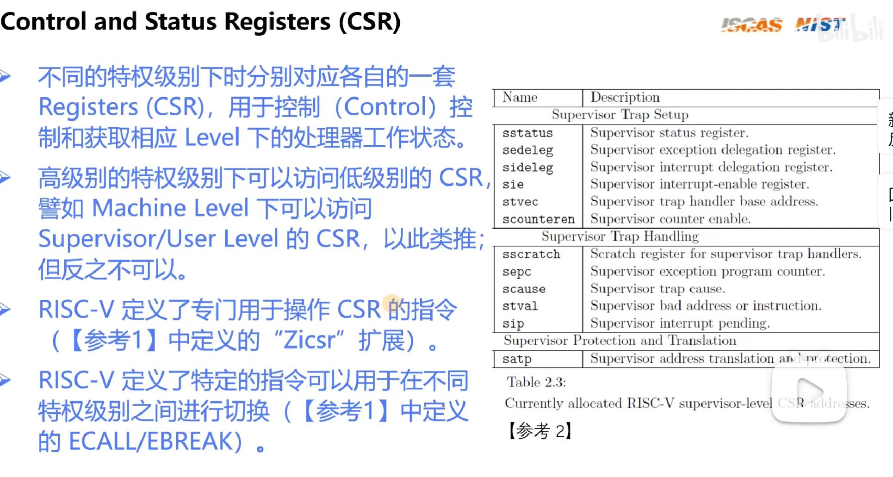

## 模块化ISA
### 增量ISA
- 计算机体系结构的传统方法，同一个体系架构下的新一代处理器不仅实现了新的ISA扩展，还必须实现过去的所有扩展，目的是为了向后的二进制兼容性
### 模块化ISA
- 由一个基本整数指令集+多个可选的扩展指令集组成，基础指令集是固定的，永远不变。那么可选的扩展指令集就像是`插件一样`
## 通用寄存器
- R5的Unprivileged Specification定义了32个通用寄存器以及一个PC,在R5，pc寄存器没有暴露，也就是说不可通过`abi name`去访问pc寄存器，而是要通过特殊的方式访问
## HART(HARdware Thread)
- `超线程`，在intel的cpu中可以同时跑`两个执行流`，那么这种执行流可以理解为`HARdware Thread`
## 特权级别
- R5有三种特权级别
    - 用户态(User)
    - Supervisor
    - Machine
    - 可选的Debug级别，一般都用不到
- 如果一个芯片只支持M模式，指的是它没有`虚拟地址`;如果只支持M模式和U模式，就是说也不支持`mmu虚拟地址`，但是分了级别;只有支持了M,U,S模式，才能够开启`mmu虚拟地址`,这个时候才能够支持`进程`的概念
- 不同的模式，并不是一个标志位不同，而是有自己特有的寄存器不同的特权级别分别对应自己的一套Registers(CSR),用于控制和获取相应level下的处理器工作状态