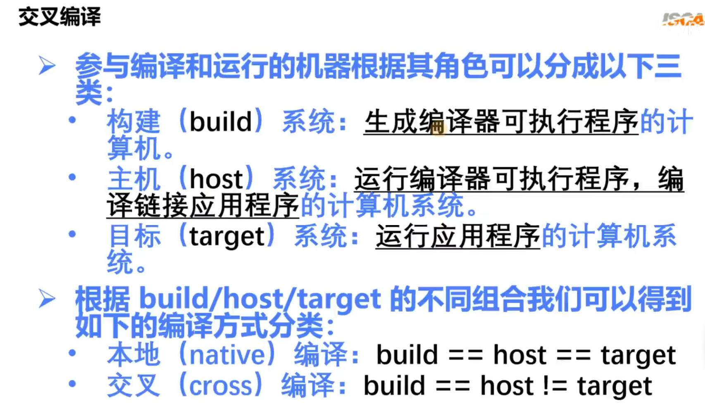
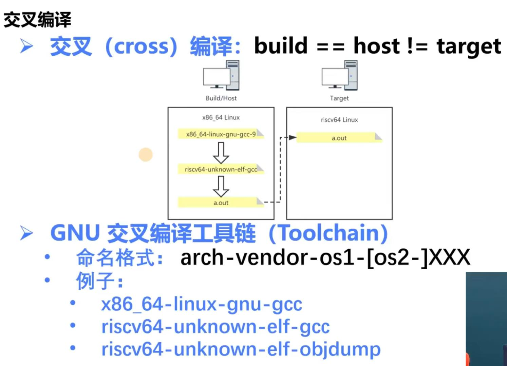
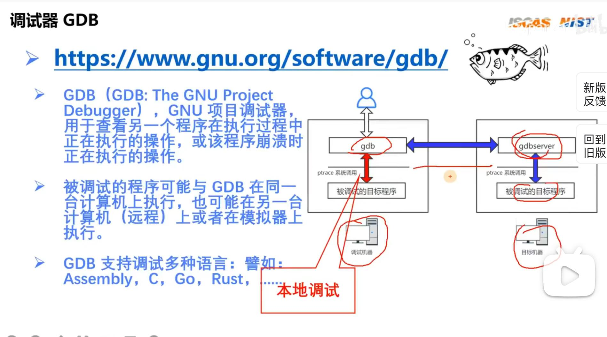
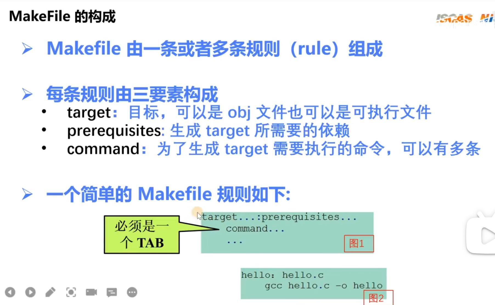

## 嵌入式开发
- 嵌入式开发是一种比较综合的技术，它不单是存粹的软件开发技术，也不单是一种硬件配置技术，它是在特定的硬件环境下针对某款硬件进行开发，是一种系统级别的与硬件结合比较紧密的软件开发技术
## 交叉编译
- 也就是运行编译器的环境和运行编译出的产物的环境不一致
- 交叉编译工具链
## GDB
- 使用`ptrace`系统调用，在使用`gdb a.out`之后，被调试程序a,out会被运行在一个被fork出来的程序中，gdb程序也会单独的运行在一个进程中，两个进程通过ptrace联系
- 远程GDB就要在目标机器上使用到`gdbserver`,需要使用模拟器(一般是qemu)来模拟目标机器
## qemu
- qemu主要有两种运作模式
    - User mode:直接运行应用程序
    - System mode: 模拟整个计算机系统，包括中央处理器及周边设备
## make
- Makefile由几条规则构成