# 第二章
### 2.1.1算术指令
- 汇编指令的变量通过`寄存器`，为了电路设计简单，汇编语言不适用变量作为操作数，而是使用`寄存器`作为操作数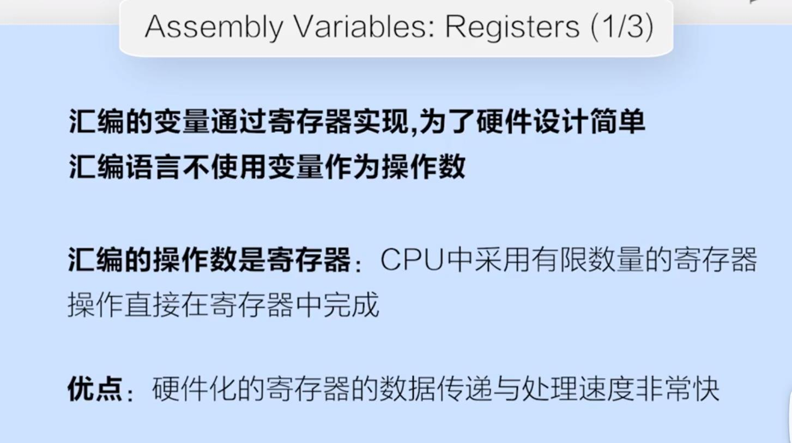
- 使用`寄存器`的缺点是，寄存器数量有限。一般通过高效使用寄存器，或者编译器优化寄存器的使用，来提升效率
- R5有32个寄存器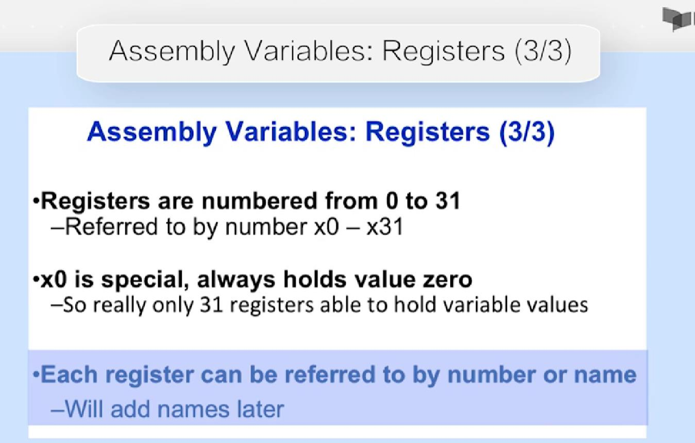
- R5的注释使用`#`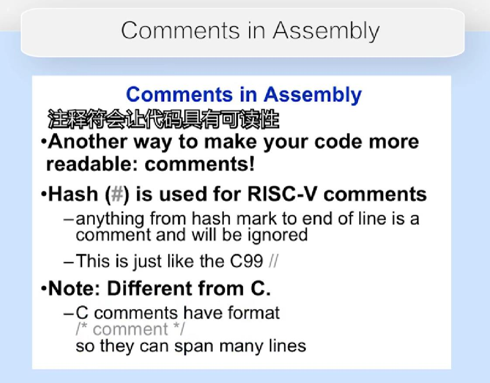
- 为什么在R5中没有`立即数减法指令`?因为可以根据`立即数加法指令`实现,在精简指令集中，如果一个操作可以由其他操作实现，那么就可以不需要增加这个操作，精简指令集设计的操作类型越少越好
- 由于`立即数0`非常常用，所以寄存器`x0`被`硬连线`为0
### 2.2.1 访存指令
- 总结
### 2.3.1 条件判断分支转移指令
- 总结
### 2.4.1 逻辑运算指令
- 总结
### 2.5.1 函数调用
- 符号寄存器
    -`a0~a7`表示参数寄存器`(x10~x17)`
    - `x0`一定是0
- `伪指令`表示一些汇编的`简写语法`
    - `mv rd, rs` 是指`addi rd, rs, 0`
    - `li rd 13`表示`addi rd, x0, 13 `
- 函数调用流程
    - 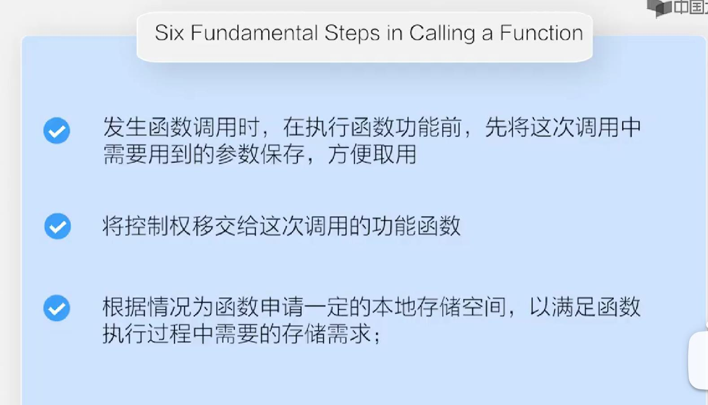
    - 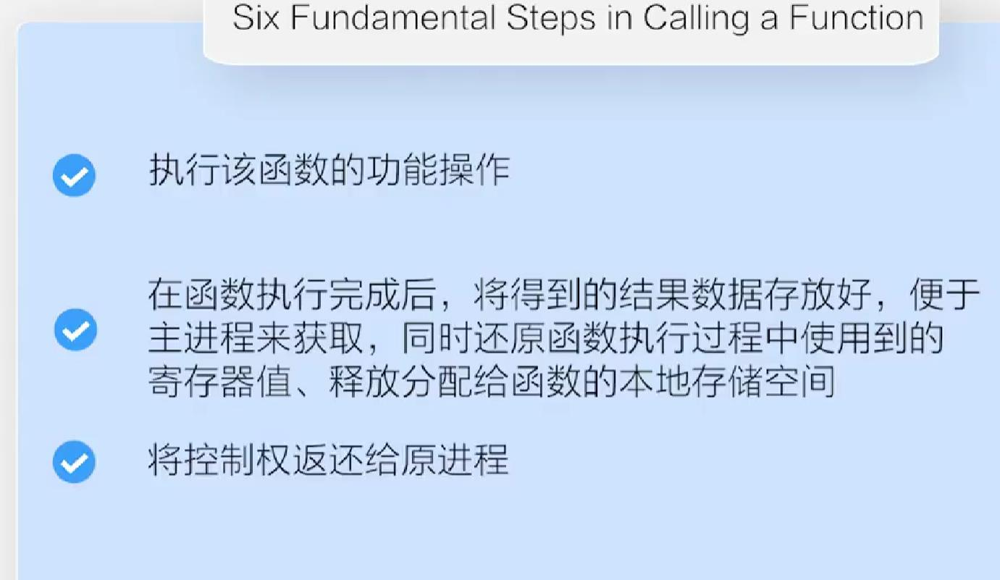
- R5中函数调用的约定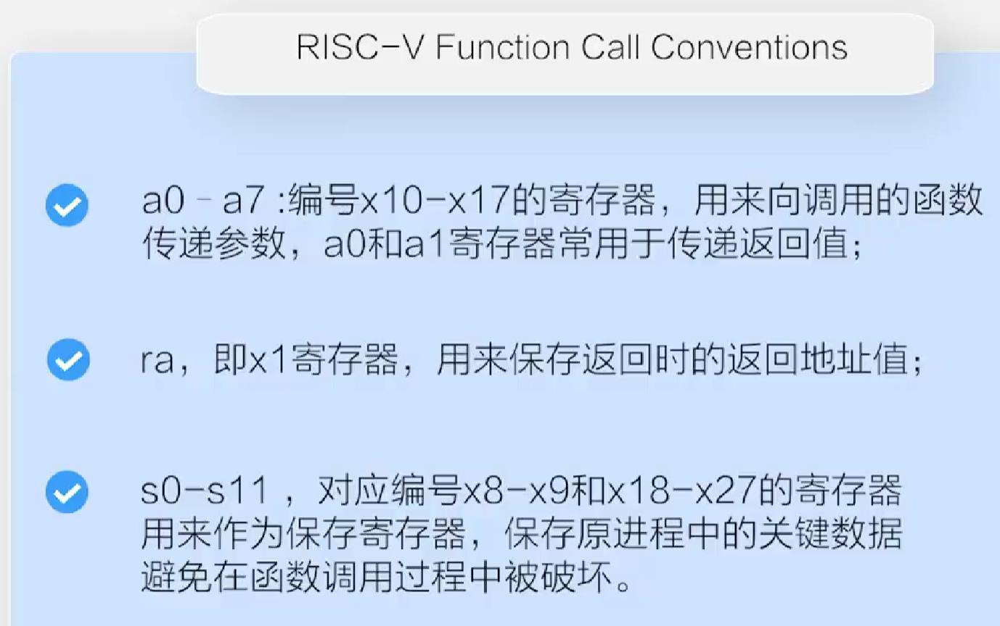
- 在`RISC-V`中所有的指令都是`4字节`
- `jal`指令是`jump 和 save return address`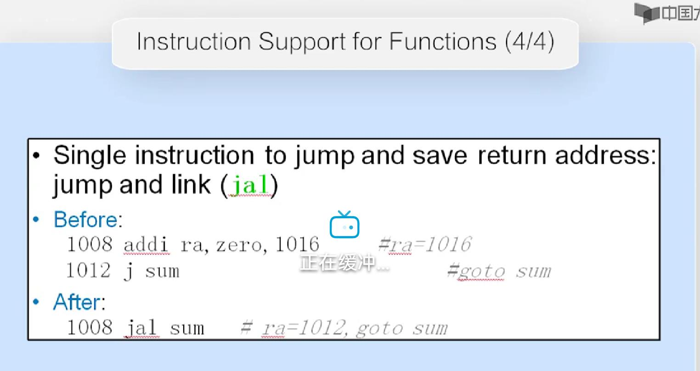
- 总结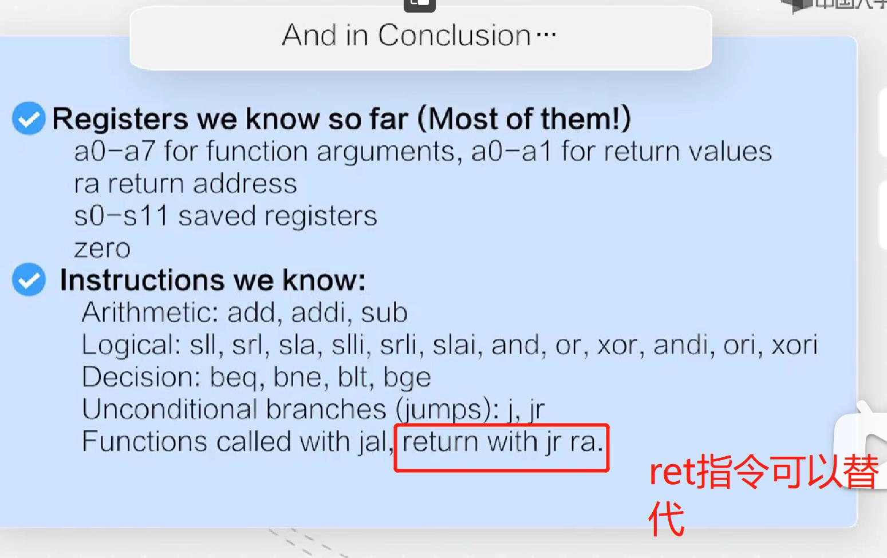
### 2.6.1 栈的使用
- `s0-s11`寄存器也就是`x8-x9,x19-x27`寄存器，一般会用来存放`局部变量和运算的中间结果值`，所以一般在函数调用前需要把它们存入栈中
- `递归调用`中，会把`a0-a7`以及`ra`中的值破坏，所以这个时候一般保存到栈中，这类寄存器就是`Caller`寄存器，可以理解为需要Caller保存的意思
- 类似于`a0-a7`这种寄存器和`ra`临时寄存器`t0-t6`这种寄存器一般可能会被Callee修改，所以`Caller`在调用函数之前，需要复制保存好它们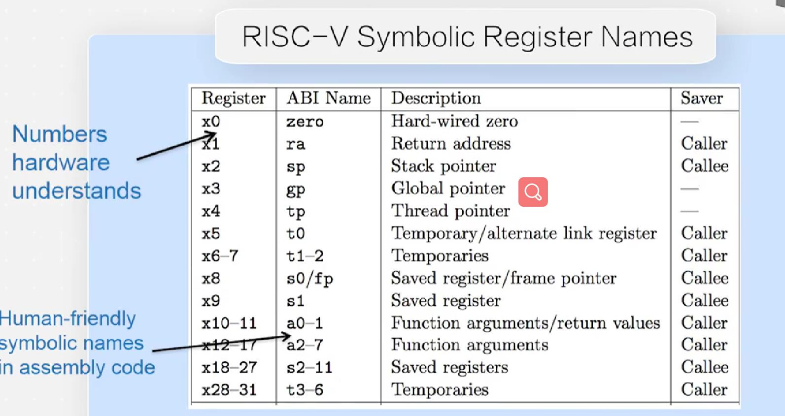这里的ABI Name指的是在汇编代码中使用这个标识来指代这个寄存器
- 对于这个图中的栈中保存的值，为什么除了`s0-s11`寄存器，还有`local variables`呢?因为struct或者数组这种一般不会存在`s0-s11`寄存器种，所以临时struct或者数组也必须存到caller栈中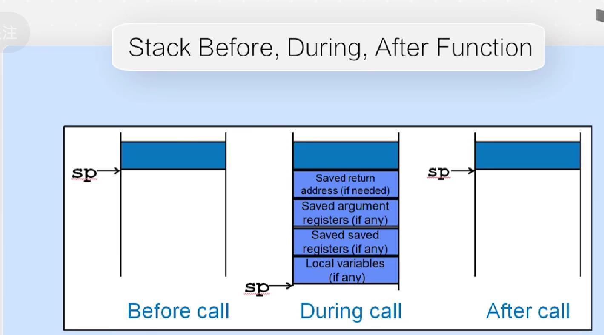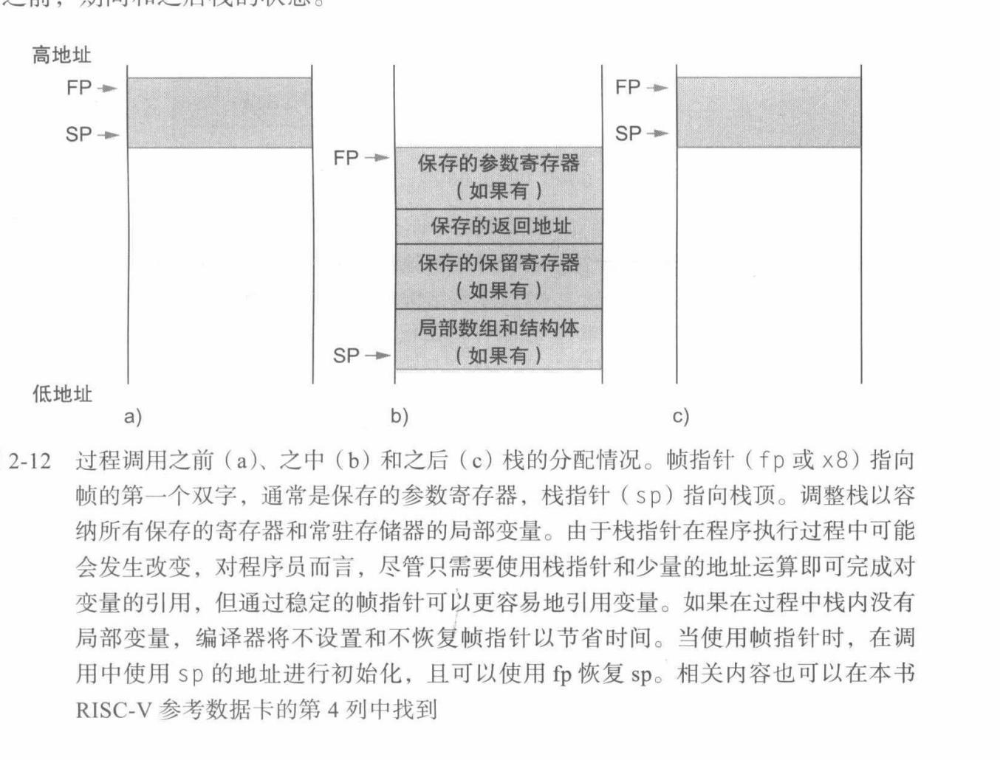
- 为什么需要两个`寄存器`存储返回值?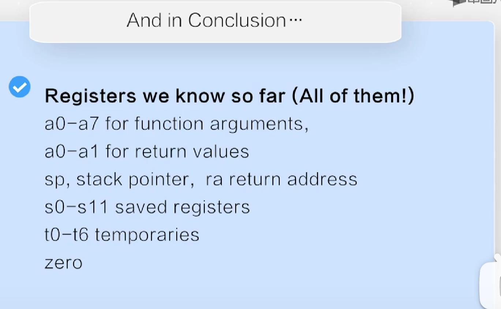因为可能需要返回62位数，而这里的`a0,a1`都是32位的
### 3.1.1 R型指令
- 为了简洁性，在`RV32，RV64，RV128`,所有RV指令都是`固定32位`
- R5有6种指令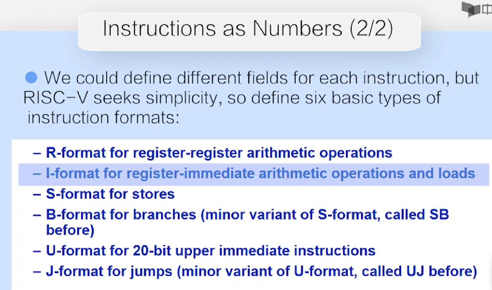
- R-型指令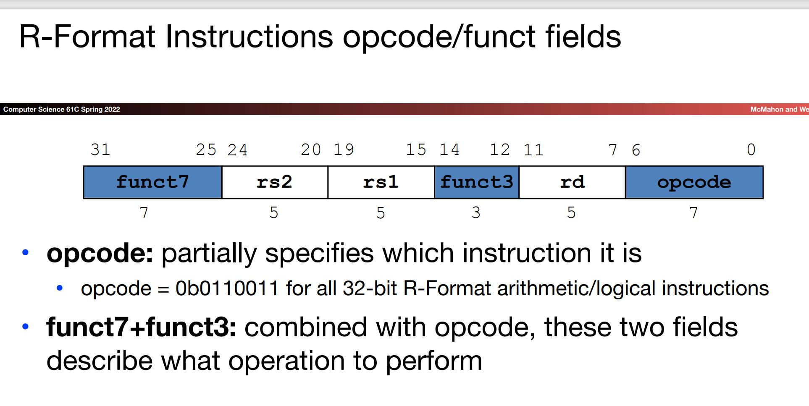,`opcode`标识R型指令的固定值，`funct7+funct3`是用来描述具体指令，其他域都是5位，因为寄存器有32个
### 3.2.1 I型指令和S型指令
- I型指令的`rs2`域和`fucnt3`域被替换位12位的`Imm[11:0]`,立即数会被符号扩展为`32`位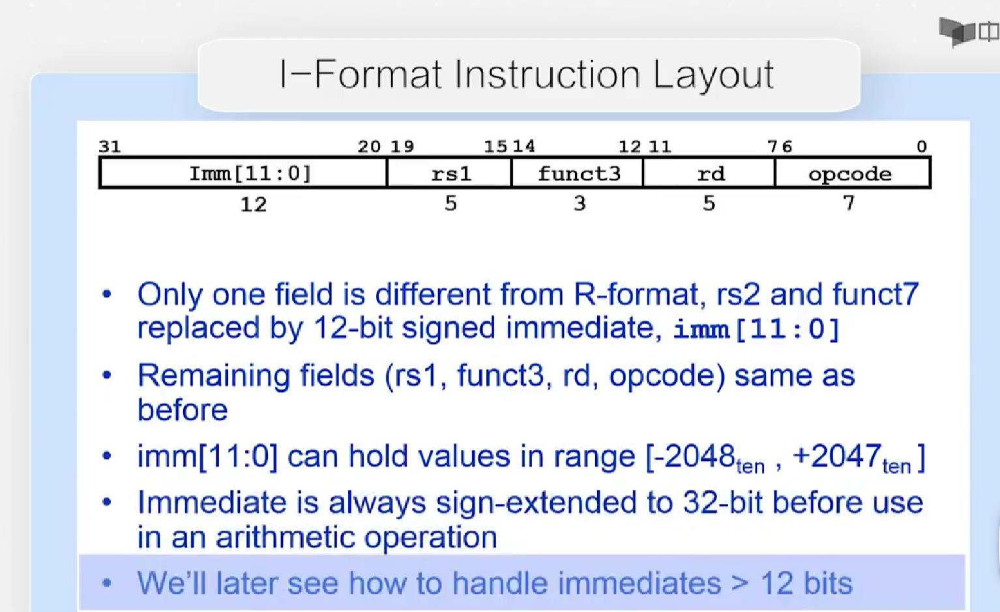
- S型指令指的是`Store`
### 3.3.1 B型指令和U型指令
- B型指令指的是`Branch`
- 由于`指令`存储在一个较为集中的区域，以及循环体一般不会太大(循环中也会用到Branch)，所以所以Branch跳转不会太大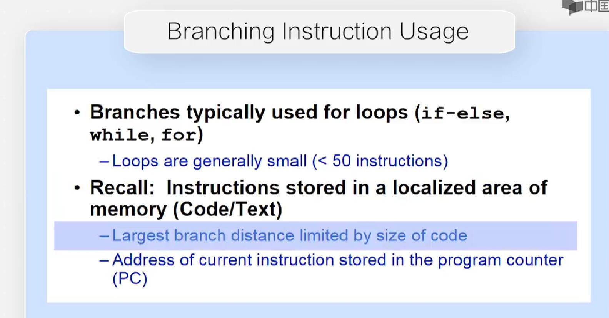,所以branch使用`相对寻址PC-Relative Addressing`,并且`偏移量`的单位是`4byt  es`,但是，R5的扩展指令存在`2字节`的扩展指令，所以偏移量单位只能是`2字节`
